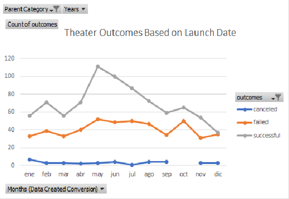
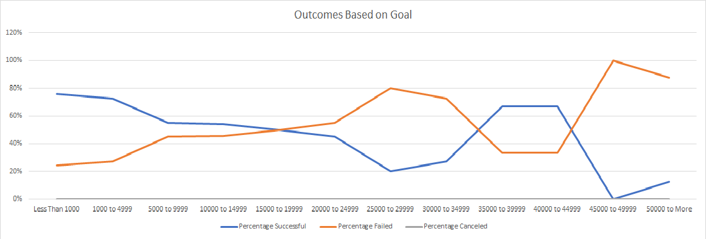

# FIRST CAMPAIGN PROJECT

## Overview

The purpose of this analysis is to be able to give Louise, an up-and-coming playwright, the confidence and knowledge, based on analysis and research, 
that she needs to be ready for launching her first fundraising campaign that will help her do her play, "Fever".

## Analysis and Challenges

In order to help Louise, we researched a database of plays from 2009 to 2017 where we identified and analyzed their goals and pledges in terms of money, as well as their final outcome based on 
additional characteristics such as date of launch, country, and category.

The first steps for this analysis were to filter the categories to only focus on theater since we are interested in a play, 
and to focus on how much money the most successful plays pointed to taking into consideration the budget of over $10,000 Louise provided us. 

For this, we created a pivot table that shows that the most successful plays were launched between the months of May to July.

Then, we created another table that represents how many plays successfully achieved their goals, monetarily speaking, 
standing among all of them the plays whose goals were $15,000 or less. 

In addition to the reviews we got before with the pivot tables, a challenge we faced during this analysis was to determine 
how valuable the number of backers was in order to succeed. For a beginner in a new field, just like Louise, the number of backers can be of great importance, however, based on the database we were able to show that regardless of the number of backers,
a play can be totally successful. 

## Conclusion and Recommendations 

Based on the chart of Theater Outcomes by Launch Date, we can conclude that the worst time of the year to launch a play is between April to August, having a rate of 50% and more of failed outcomes.
Along with this, another conclusion we can get from this chart is that people started to get more interested in plays after 2012 until now, 
leading most of the play's performance achieved great success.

On the other hand, the chart of Outcomes Based on Goals led us to the conclusion that people who tried to achieve more than $20,000 failed in their majority, and the few that achieved it can be shown as 2/7.

Moreover, one big limitation of this dataset is that it does not show a specific reason why some plays did not succeed or what kind of plays are the ones that attract most people. 
Also, it would have been of great help to knew not only countries but also cities where there is more population or more tourism. In this way, we can focus on some specific areas instead of all of them.

Finally, some tables that we can also create to help us with this analysis are country and blurb tables. These two tables can help us to narrow the space we are focused on as well as give us new ideas on how to attract more people to the play.
